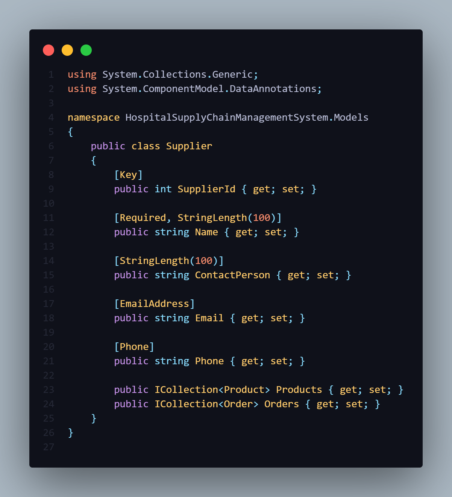
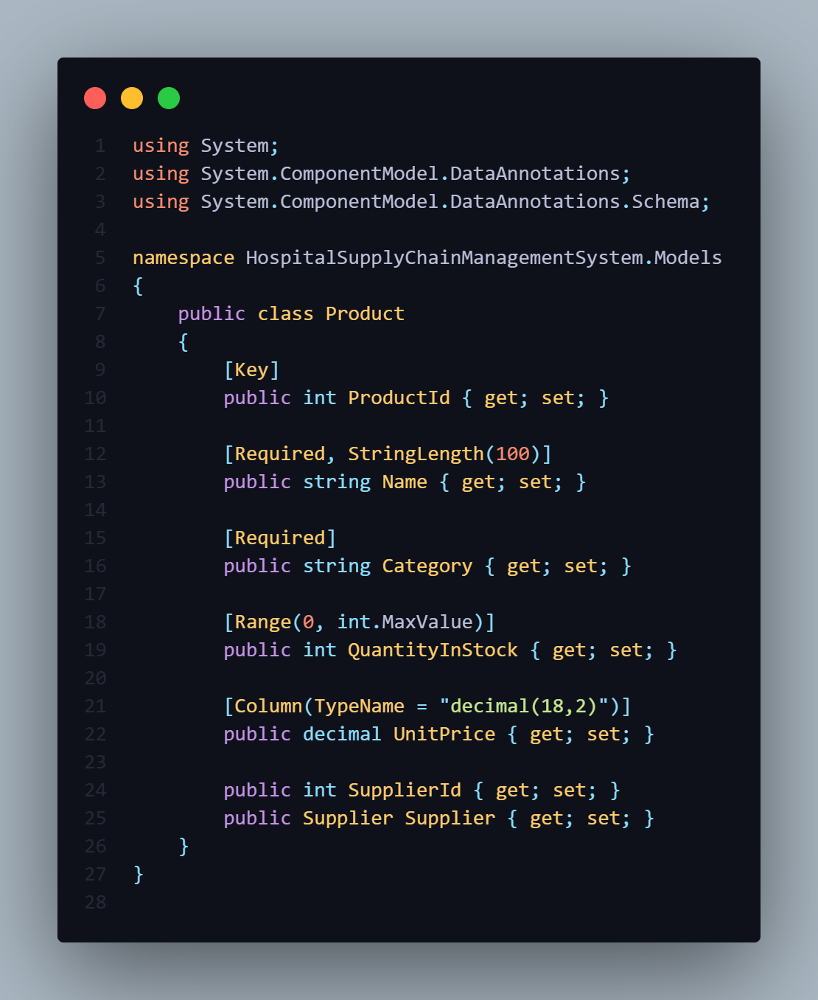
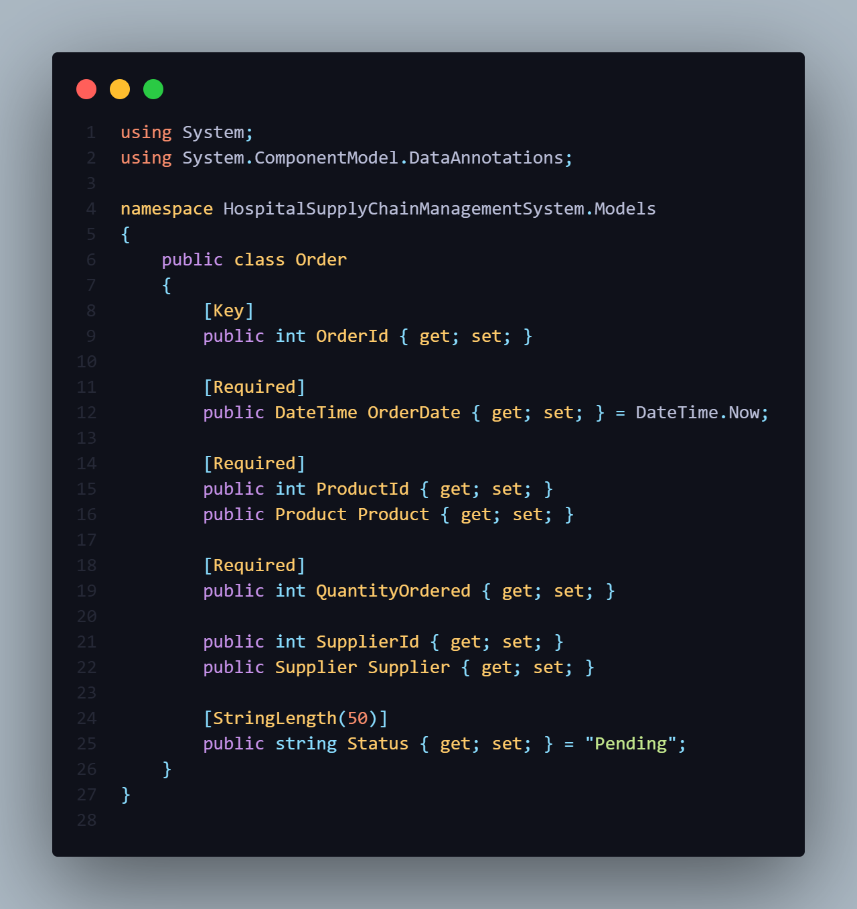
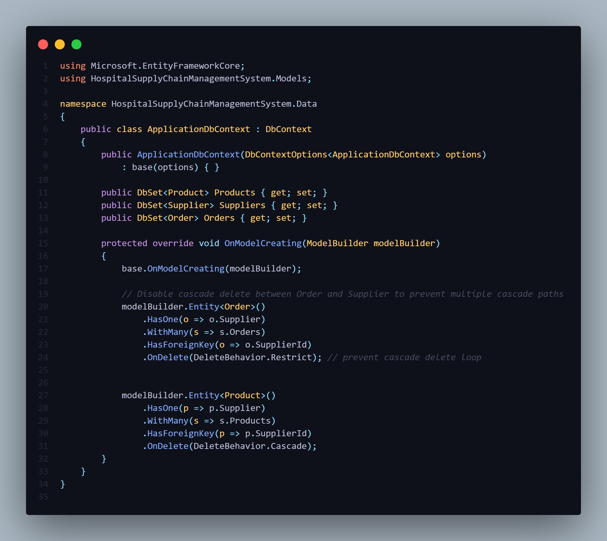
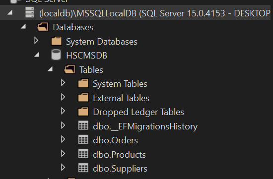

# Hospital Supply Chain Management System (HSCMS)

# 🏥 Hospital Supply Chain Management System  
## Week 15 –Stored Procedures (HSCMSBD)
# COP2839 ASP.NET Program w/C#
# Instructor: Franklin Castillo 
# Taneisha Milkunic
# December 2025

For Week 15 I implemented a stored procedure feature in the Hospital Supply Chain Management System to demonstrate how ASP.NET Core and EF Core can call SQL Server stored procedures safely. I focused on a realistic supply chain scenario: finding products that are at risk of stocking out.

First, I created a T-SQL script called `DatabaseScripts/Week15_GetLowStockProducts.sql` and committed it to the repository. This script creates a stored procedure named `dbo.GetLowStockProducts` in the HSCMSDB database. The procedure takes one integer parameter, `@Threshold`, and returns rows from the `Products` table where `QuantityInStock` is less than or equal to that threshold. The results include key columns such as ProductId, Name, Category, QuantityInStock, UnitPrice, and SupplierId and are ordered by quantity and product name. I verified this procedure directly in SQL Server by running `EXEC dbo.GetLowStockProducts @Threshold = 10` and confirming that it returned the expected low-stock products.

Next, I wired it into the MVC app using EF Core. In `HomeController`, I injected `ApplicationDbContext` and added a new action `LowStock(int threshold = 10)`. Inside this action I used `FromSqlInterpolated("EXEC dbo.GetLowStockProducts {threshold}")` to execute the stored procedure. This approach passes the `threshold` parameter safely instead of concatenating SQL, which helps prevent injection issues. The action returns a strongly-typed view (`Views/Home/LowStock.cshtml`) that renders the results in a table and explains that the data is coming from a stored procedure. I also updated my configuration so both `appsettings.json` and `appsettings.Development.json` point to the HSCMSDB database. Together, the SQL script, controller action, and view satisfy the Week 15 requirements for executing a stored procedure, handling parameters safely, and displaying the results in the UI with clear evidence in the repo.

# Hospital Supply Chain Management System (HSCMS)

# 🏥 Hospital Supply Chain Management System  
## Week 14 – Logging
# COP2839 ASP.NET Program w/C#
# Instructor: Franklin Castillo 
# Taneisha Milkunic
# November 2025

**Overview**

For this week I set up logging for both successful and failed operations. Every request now has a correlation ID, and the log messages themselves 
include details. First, I modified the logging settings in Program.cs. This involved enabling console logging and then adding a custom logging scope
middleware.  This middleware adds a unique CorrelationId, along with the request route and HTTP method, to each log entry associated with a particular
request.  This approach simplifies the process of tracking a request's journey, from its initial trigger to its final outcome, even when the controller
is handling several tasks simultaneously.  This becomes very valuable down the line, especially if the project is deployed using tools like Azure App 
Insights or ELK. 

I next turned my attention to the VendorsController, adding structured log entries.  The Index and Details actions, for instance, now log successful 
lookups. Conversely, the Create and Edit actions trigger warning logs when validation fails. If a DbUpdateException is thrown, error logs are generated
within the catch blocks.  The logs also provide useful data such as {VendorId} and {CorrelationId}, which significantly simplifies the process of
diagnosing certain problems. 

To check for error I requested a supplier that I know weren't there.

# 🏥 Hospital Supply Chain Management System  
## Week 12 – CRUD (Vendors Vertical Slice)
# COP2839 ASP.NET Program w/C#
# Instructor: Franklin Castillo 
# Taneisha Milkunic
# November 2025

**Overview:**  
This week’s task was to implement a complete CRUD feature using ASP.NET Core MVC and EF Core with asynchronous operations and validation.

**What was implemented:**  
- Added `Vendor` model with `[Required]`, `[EmailAddress]`, and `[Phone]` attributes.  
- Registered the `DbSet<Vendor>` in `ApplicationDbContext`.  
- Generated `VendorsController` and Razor Views with full async support:
  - `ToListAsync()` for listing data  
  - `FindAsync()` / `FirstOrDefaultAsync()` for detail retrieval  
  - `SaveChangesAsync()` for create/edit/delete  
- Configured validation feedback in Create/Edit views.  
- Verified environment-specific configuration and connection string using LocalDB.  

**Evidence:**  
Screenshots in file folder

# 🏥 Hospital Supply Chain Management System  
## Week 11 – Separation of Concerns & Dependency Injection
# COP2839 ASP.NET Program w/C#
# Instructor: Franklin Castillo 
# Taneisha Milkunic
# November 2025

## Week 11 — Separation of Concerns & Dependency Injection

This week I refactored the Hospital Supply Chain Management System (ASP.NET Core MVC, .NET 8) to follow Separation of Concerns and use Dependency Injection for non-UI logic. I introduced a service layer that centralizes business rules and data access coordination so controllers remain thin and focused on HTTP concerns.

### What I implemented
- **Service contract** `IInventoryService` with `GetDashboardSummaryAsync()`.
- **Concrete service** `InventoryService` that uses `ApplicationDbContext` to compute a dashboard summary (products, suppliers, and order status counts).
- **DI registration** in `Program.cs` using `AddScoped<IInventoryService, InventoryService>()` (Scoped is appropriate for EF Core–backed services).
- **Controller injection** in `HomeController` and an async `Index` action that calls the service and returns a `DashboardSummary` model to the view.
- **View update** (`Views/Home/Index.cshtml`) strongly typed to `DashboardSummary`.

### Why this matters
Moving logic from controllers into services improves testability (mock the service), reuse (share across controllers), and maintainability (clearer responsibilities). DI decouples the interface from its implementation and makes dependencies explicit.

### Files
- `/Services/IInventoryService.cs`
- `/Services/InventoryService.cs`
- `/Models/DashboardSummary.cs`
- `/Controllers/HomeController.cs` (constructor + Index)
- `/Views/Home/Index.cshtml`
- `/Program.cs` (DI registration)

### Screenshots
Include: Solution Explorer showing `Services/`, DI registration in `Program.cs`, `HomeController` constructor with `IInventoryService`, and the running dashboard page.

# 🏥 Hospital Supply Chain Management System  
## Week 10 – Modeling

# COP2839 ASP.NET Program w/C#
# Instructor: Franklin Castillo 
# Taneisha Milkunic
# October 2025

### **Feature Implemented:**  
Creation of core data models for the Hospital Supply Chain Management System (HSCMS).

### **Objective:**  
To design the foundational database structure representing hospital supply chain entities (Suppliers, Products, and Orders) and establish relationships among them using Entity Framework Core in ASP.NET Core MVC.

---

### **Implementation Summary**

In Week 10, the modeling phase was completed by defining three primary entities: **Supplier**, **Product**, and **Order**, representing the key components of the hospital’s supply chain.  
Each class was defined in the `Models` folder with properties corresponding to essential database fields such as product name, quantity, supplier contact information, and order details.  

Following screenshot presents each individual class:

Supplier.cs  

Product.cs  

Order.cs  

These entities were registered in the **`ApplicationDbContext`** class using `DbSet<T>` properties, allowing Entity Framework Core to generate corresponding database tables.  
Relationships were configured within the `OnModelCreating()` method to manage one-to-many associations between Suppliers and Products, and between Suppliers and Orders.  

A crucial design decision was to apply `.OnDelete(DeleteBehavior.Restrict)` for the `Order → Supplier` relationship to prevent multiple cascade paths, while maintaining `.OnDelete(DeleteBehavior.Cascade)` for `Product → Supplier`.  
This ensures that deleting a supplier automatically removes their products but restricts deletion when dependent orders exist.  

`ApplicationDbContext` showing Fluent API configuration with `OnDelete(DeleteBehavior.Restrict)`

After defining the models, the migration command `Add-Migration InitialCreate` was executed followed by `Update-Database`, successfully creating the **HSCMSDB** database with all related tables.  
Verification was performed through **SQL Server Object Explorer**, confirming the tables’ creation and relationships.

---

